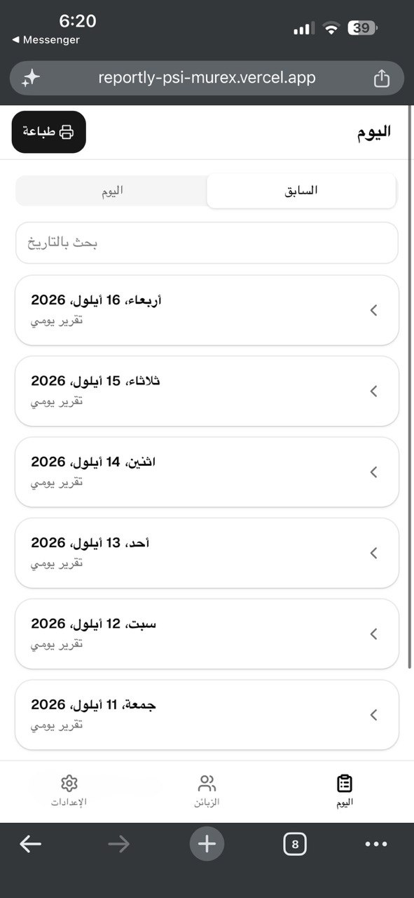
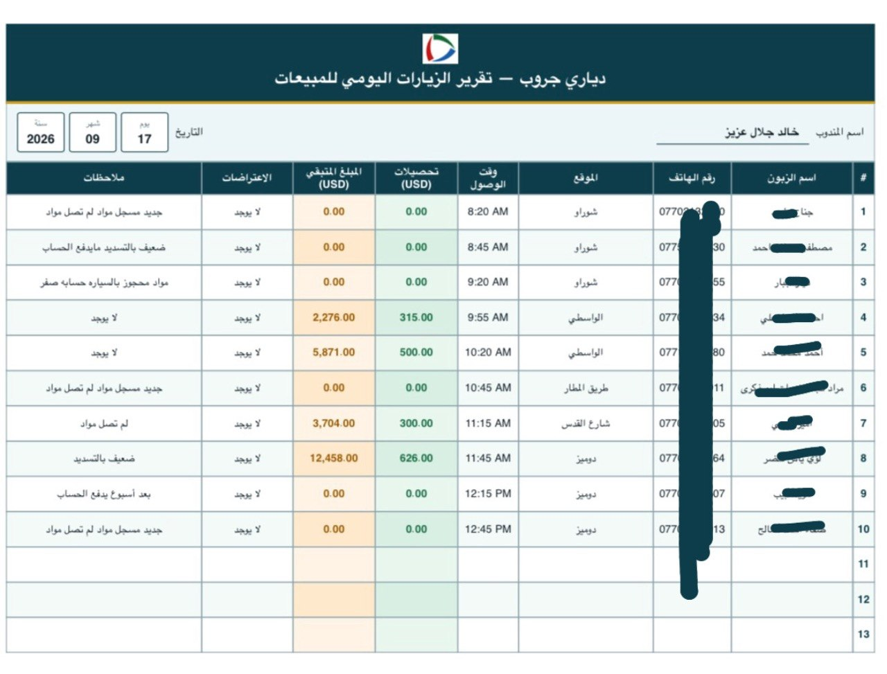
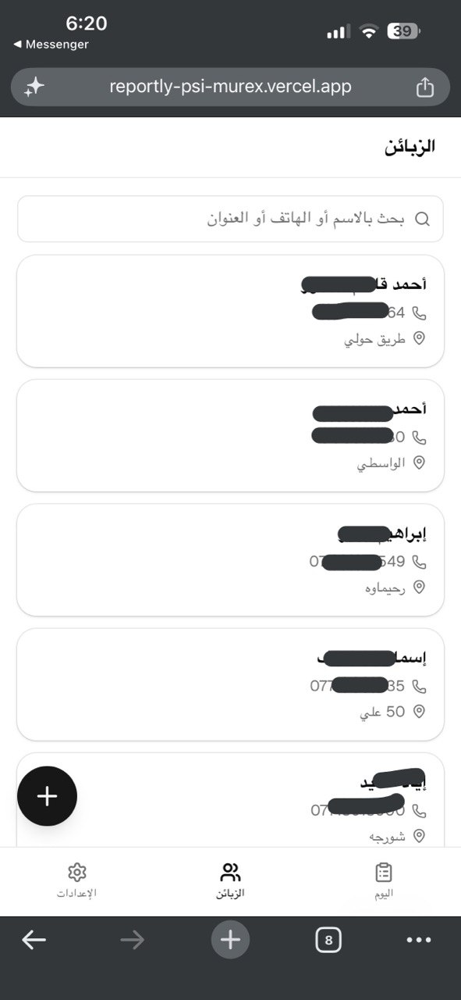
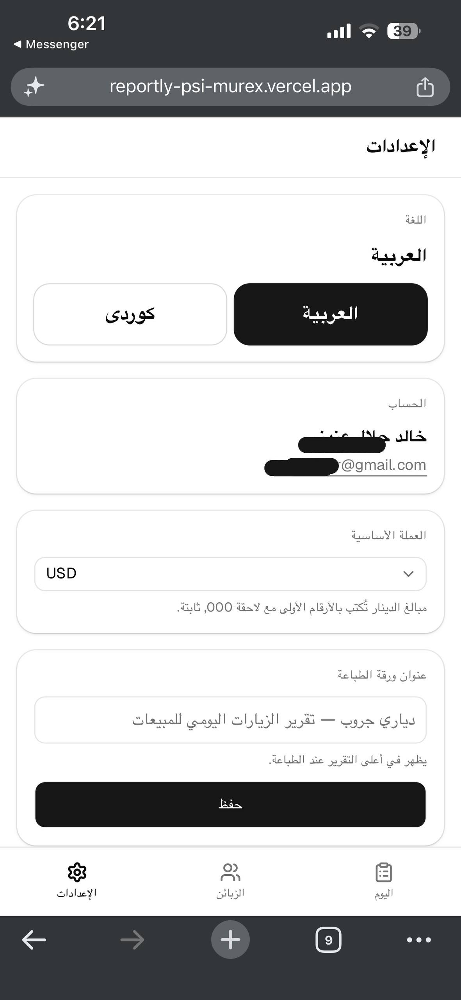

# Sales Represntive Web app 

A simple web application for recording and managing daily business reports.

Reportly was designed to replace manual daily reporting workflows with a centralized digital system.

## Screenshots

<p align="center">
  
  
</p>

<p align="center">
  
  
</p>

## Features

* Daily report management
* Customer management
* Visit tracking
* Amount collected tracking
* Remaining amount tracking
* Centralized report history
* User authentication
* Configurable base currency
* Simple and focused interface
* Data stored in a relational database
* Export-ready reporting structure

## Technology Stack

* React
* Supabase
* PostgreSQL
* Authentication
* Modern web UI

## Data Model

The application uses a relational structure for managing users, customers, and daily reports.

```text
Users
 │
 └── Daily Reports
       │
       ├── Customer
       ├── Visit
       ├── Amount Taken
       └── Amount Left
```

## Purpose

The goal of Reportly is to simplify daily reporting by replacing handwritten records and manually maintained tables with a digital workflow.

## Project Status

Completed project / portfolio project.

## ✍️ Author
Ealam Dhahir Taher
- GitHub: https://github.com/EaloTaher
- LinkedIn: https://www.linkedin.com/in/ealam-taher
- Email: ealamtaher4@gmail.com
